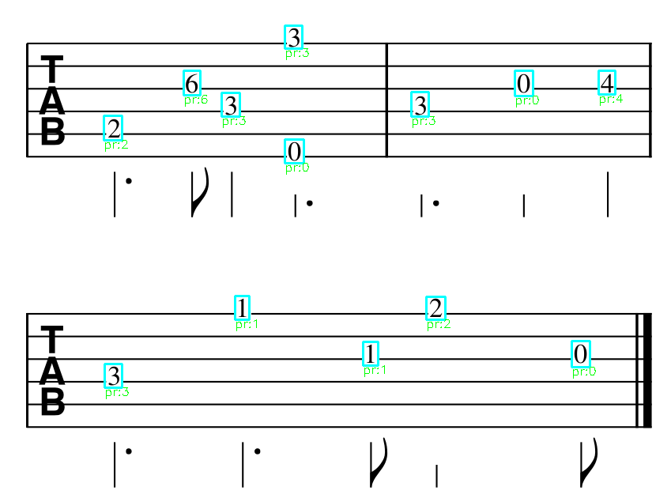

# TabOMR

**TabOMR** is a hybrid OMR (Optical Music Recognition) system designed for recognizing guitar tablature from printed images. It combines object detection and digit recognition to analyze tablature elements and convert them into structured musical data.

## 📃 Overview

TabOMR takes a scanned or printed image of guitar tablature and performs the following:

- Detects all relevant tablature components (e.g., staff lines, fret numbers, note durations, barlines)
- Recognizes digits and muted notes using a CNN-based OCR model
- Processes the layout: assigns notes to strings, bars, and chords
- Reconstructs the music structure and exports the result in **MusicXML** format

## 📎 Input format

The system works with printed guitar tablature that meets the following structure:

- 6 horizontal staff lines  
- Fret numbers ranging from 0 to 24  
- Symbols for muted notes: `"X"`  
- Rhythm symbols placed above notes to indicate duration  
- Consistent layout with one or more staves per image

**Example input:**  
 
  


## 🚀 How to run

### 1. Clone the repository

```bash  
git clone https://github.com/yourusername/tabomr.git  
cd tabomr
```

### 2. Install dependencies

It's recommended to use a virtual environment. Then install required packages:

```bash  
pip install -r requirements.txt  
```

### 3. Set input image path

In `main.py`, find the following line (line 21):

```python  
image_path = "your_input_image.png"  
```

Replace `"your_input_image.png"` with the name or path to your tablature image.

### 4. Run the system

```bash  
python main.py  
```

The **output** MusicXML file will be saved in the `outputs_final/` folder.

You can also see the **intermediate results** in `outputs_working` folder.

## 🧠 Models used

TabOMR uses a hybrid deep learning setup:

- **YOLOv8s** – for detection of tablature elements (staff lines, fret numbers, durations, barlines, etc.)  
- **CNN-based OCR model** – for recognition of digits (fret numbers) and dead notes ("X")

The models were trained on custom datasets. See the `/models/` directory for saved weights.

## 📌 Limitations

This system currently supports printed guitar tablature with the following elements:

- Six horizontal staff lines  
- Fret numbers (0–24)  
- Muted notes ("X")  
- Duration symbols:  
  - `eighth_note`, `quarter_note`, `half_note`, `whole_note`  
  - dotted versions: `quarter_note_dot`, `half_note_dot`  
  - `eighth_note_two` (double beams)

All symbols must be printed clearly. Handwritten notation is **not** supported.

All duration symbols must be placed **under the staff**, neither above the staff nor on the staff lines. 
Currently, TabOMR system does not support any other format of the tablature.

## 🔄 Examples

#### Input image: 


---

#### Output image opened in MuseScore 3 desktop application:

  

_MuseScore: https://musescore.org/uk_
#### Output image opened on Soundslice:

  

_Soundslice: https://www.soundslice.com/musicxml-viewer/_

You can find this example output file in `/examples` folder.

---

#### Intermediate results:

 

---

 

---

 

---

 

---

## 📄 License

This project is licensed under the MIT License. See the [LICENSE](LICENSE) file for details.

---

## 🔗 Contact

Hi there! <br>
I'm always happy to collaborate and discuss ideas. <br>
Feel free to contact me! 🤝🏻 <br>
**Email**: kristik25978@gmail.com

